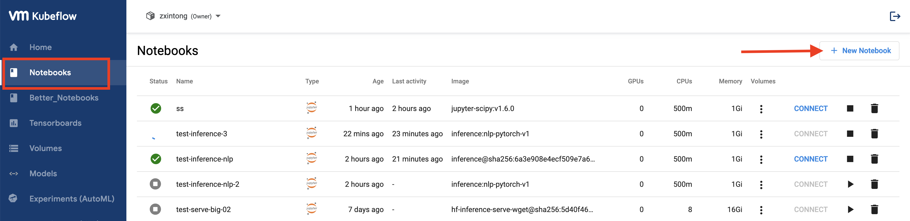
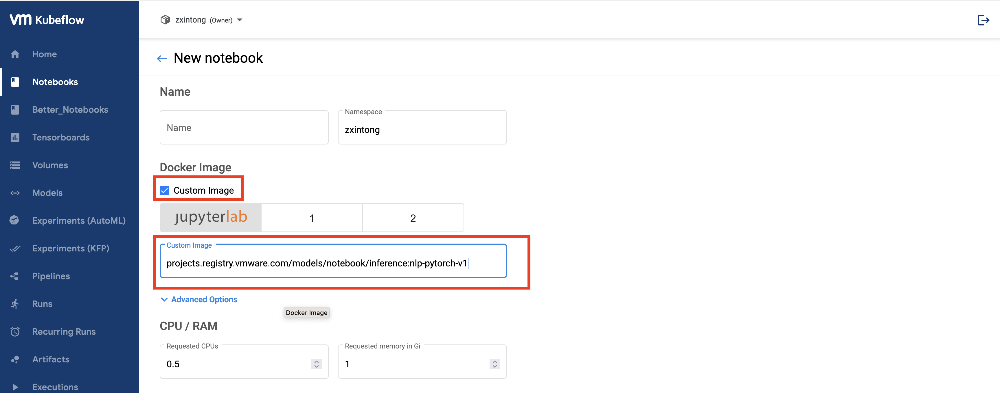
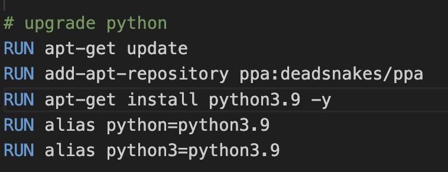
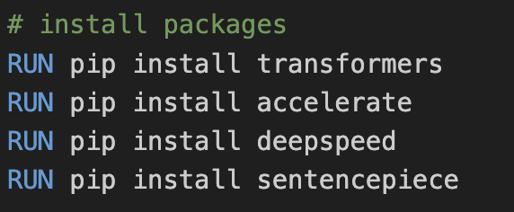

# VMware Kubeflow Models Notebook Images

**Catalogue**

- [Images](#images)
- [How to use](#how-to-use)
- [Customize the images](#customize-the-images)
    - [Customize](#customize)
    - [Build](#build)
- [Appendix: images only for internal usage](#appendix-images-only-for-internal-usage)

## Images

Images that are planned to be formally released are listed below.

| Image | Base Image | Already Have (in Base Image) | Extra Packages | Functions |
| ----- | ---------- | ---------------------------- | -------------- | --------- |
| [projects.registry.vmware.com/models/notebook/inference:nlp-pytorch-v1](./inference-nlp-pytorch/Dockerfile) | `public.ecr.aws/j1r0q0g6/notebooks/notebook-servers/jupyter-pytorch-cuda-full:v1.5.0` | `python3.8`, `pip`, `kfp`, `kfp-server-api`, `kfserving`, `bokeh`, `cloudpickle`, `dill`, `ipympl`, `ipywidgets`, `jupyterlab-git`, `matplotlib`, `pandas`, `scikit-image`, `scikit-learn`, `scipy`, `seaborn`, `xgboost`, `fastai`, `torch`, `torchvision`, `torchaudio`, `bash`, `bzip2`, `locales`, `nano`, `unzip`, `vim`, `zip`, `ca-certificates`, `git`, `gnupg`, `gnupg2`, `lsb-release`, `software-properties-common`, `tzdata`, `git`, `curl`, `wget`, `kubectl`, `jupyterlab`, `notebook`, `ipykernel`, `numpy`, `requests` | `python3.9`, `transformers`, `accelerate`, `deepspeed`, `sentencepiece` | NLP model inference |
| [projects.registry.vmware.com/models/notebook/inference:cv-pytorch-v1](./inference-cv-pytorch/Dockerfile) | `public.ecr.aws/j1r0q0g6/notebooks/notebook-servers/jupyter-pytorch-cuda-full:v1.5.0` | Same as above | `python3.9`, `accelerate`, `opencv-python-headless`, `diffusers` | CV model inference |

## How to use

To use these images, on Kubeflow UI, click "Notebooks" on the left panel, and click "+ New Notebook" on the top right cornor.



In the notebook creation page, in "Docker Image" section, choose "Custom Image", and enter the image you would like to use in the input box.



Note that in images `inference:nlp-pytorch-v1` and `inference:cv-pytorch-v1`, we installed Python 3.9 for you. And if you use these two images and would like to change the default version of Python, you can run following commands in your notebook server:

```shell

alias python=python3.9
alias python3=python3.9

```

And you can check the exiting Python versions in your notebook server using following command:

```shell

ls /usr/bin/python**

```

## Customize and build the images

This repo contains the Dockerfile of our provided images. Please feel free to use them as a template for further customization.

For those who would like to customize the notebook image, below notes and instructions may help.

### Customize

#### Base image

To change the base image, edit the very first beginning line in the Dockerfile. Note that if the base image is changed, some packages and their versions may be changed as well.


#### Python version

Our provided images installed Python 3.9. To change the default python version, check "upgrade python" section.



#### Add packages / Change package versions

To add extra packages or to change package versions, check "install packages" section.



### Build

We will use `inference:nlp-pytorch-v1` image as an example. 

Note that you would need an image repo (such as Docker Hub) to store your image.

#### Step 1: Build the image

```shell

cd inference-nlp-pytorch
docker build -t inference:nlp-pytorch-v1 .

```

#### Step 2: Tag the image

```shell

docker image tag inference:nlp-pytorch-v1 <image_tag_according_to_rules_of_your_image_hub>

```

#### Step 3: Push the image

```shell

docker push <image_tag_according_to_rules_of_your_image_hub>

```

## Appendix: Images only for internal usage

Note that below listed images are only for internal usage, and may not be released formally.

| Image                                                                               | Description                                       |
| ----------------------------------------------------------------------------------- | ------------------------------------------------- |
| [HuggingFace Hub model inferencing and serving](./internal-usage/hf-inference-deploy/Dockerfile)   | Ready to run and serve models in HuggingFace Hub. |
| [Serve models using Torchserve with GPU](./internal-usage/serve-torchserve-gpu/Dockerfile)         | General image to serve big models using Torchserve server with GPU. |
| [YOLOv5 (helmet) model deployment, fine-tune, KServe](./internal-usage/yolov5/Dockerfile)          | Deploy, fine-tune, and serve YOLOv5 (helmet detection) using KServe. |
| [HuggingFace Hub model with `wget` and `curl`](./internal-usage/hf-inference-serve-wget/Dockerfile) | Ready to run and serve models in HuggingFace Hub, along with extra `wget` and `curl` packages. |
